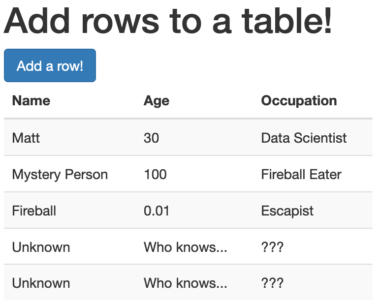

# Add rows to a table
This is a simple project utilizing [D3.js](https://d3js.org/) and [Bootstrap](https://getbootstrap.com/docs/3.4/css/) to add rows to a table when the user clicks the button.



### Behind the scenes!
`data.js` stores an array of objects, `data`, that serves as the "actual" data for our table. It also has an object, `placeholder`, that we use to fill rows in the table once we run out of arrays in `data`.

```javascript
// "Actual" data for table
var data = [
    {name: "Matt",
     age: 30,
     occupation: "Data Scientist"
    },

    {name: "Mystery Person",
     age: 100,
     occupation: "Fireball Eater"
    },

    {name: "Fireball",
     age: 1e-2,
     occupation: "Escapist"
    }
];

// Placeholder data for when we run out of data
var placeholder = {
    name: "Unknown",
    age: "Who knows...",
    occupation: "???"
};
```

We instantiate an `index` in `app.js` and then define a function, `addRow`, which checks whether the index is within the range of our `data` array. If it is, that object is queued up to be added to the table. If not, we use the placeholder data instead.

```javascript
// Add data from our array if available
if (index < data.length) {
    console.log(`Adding ${data[index].name} to table`);
    var person = data[index];
}
else {
    console.log("Adding placeholder to table");
    var person = placeholder;
}
```

We then use D3 to dynamically create a row by selecting the `tbody` tag and appending a `tr`. If we had multiple tables in `index.html`, it'd be safer to create an ID for the table and specify that instead, but this works for now.

```javascript
var row = d3.select("tbody").append("tr");
```

Finally, we use `Object.values` to access the values of the object, then iteratively create `td` elements with `forEach`.

```javascript
Object.values(person).forEach(value => {
    row.append("td").text(value);
});
```

Our `addRow` function is called when our event listener on line 27 sees that the button has been clicked. The rest, as they say, is history!

```javascript
d3.select("#button").on("click", addRow);
```
