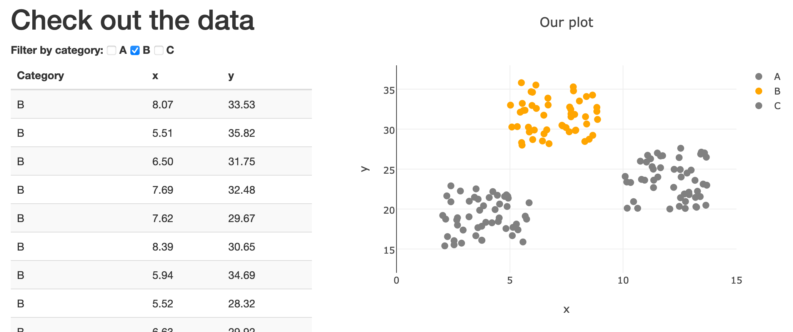

# Little projects in JavaScript
Here are a collection of projects in JavaScript, mainly me learning how to use the language.

## 1. [Add rows to a table](addRow)

## 2. [Interactive filtering](filterFanatic)

