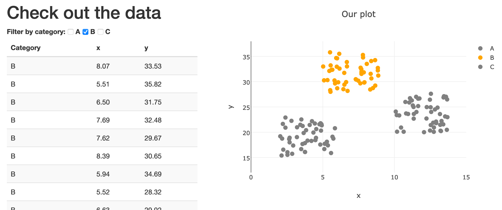

# Filter Fanatic
This is a project demonstrating how to filter a table and dynamically update a Plotly plot.



## How it works
### `data.js`
We randomly generate the data in the plot whenever the page is launched. `data.js` contains an object of objects that specify the characteristics of the data we're generating, namely the rough x- and y-location, as well as the color of the points.

```javascript
const CATEGORIES = {
    A: {
        x_mean: 2,
        y_mean: 15,
        color: 'red'
        },
    B: {
        x_mean: 5,
        y_mean: 28,
        color: 'orange'
       },
    C: {
        x_mean: 10,
        y_mean: 20,
        color: 'blue'
       }
};
```

We then iterate through each category in `CATEGORIES`, generating `N_SAMPLES` points drawn from a uniform distribution. `Math.random` generates values between 0 and 1, which we multiply by `X_SPREAD` or `Y_SPREAD` and add to the category's `.x_mean` or `.y_mean` attribute, respectively. Our final result is an array of objects called `DATA`.

```javascript
Object.entries(CATEGORIES).forEach(obj => {

    for (var i = 0; i < N_SAMPLES; i++) {

        var sample = {
            category: obj[0],
            x: (obj[1].x_mean + X_SPREAD * Math.random()).toFixed(2),
            y: (obj[1].y_mean + Y_SPREAD * Math.random()).toFixed(2)
        };

        DATA.push(sample);
    }

});
```

### `index.html`
Our HTML is fairly straightforward. We use the Bootstrap grid to create two columns, one for our table and one for our Plotly plot. We start with the checkboxes for the categories of data.

```html
<h1> Check out the data </h1>
<strong>Filter by category: </strong>
<input type="checkbox" id="A">
<label for="A">A</label>
<input type="checkbox" id="B" checked>
<label for="B">B</label>
<input type="checkbox" id="C">
<label for="C">C</label>
```

We then start our table by creating the header. The rows will be filled in dynamically with D3 later.

```html
<table class="table table-striped">
<thead class='thead-dark'>
    <tr>
        <th>Category</td>
        <th>x</td>
        <th>y</td>
    </tr>
</thead>
<tbody></tbody>
</table>
```

Finally, we have an empty div for the plot. This will also be filled in with D3.

```html
<div class="col-xs-6">
    <div id="plot"></div>
</div>
```

### `app.js`
We start by defining the helper functions `getCheckboxStatuses`, `onlyUnique`, and `getColor`. `getCheckboxStatuses` returns an object with `true`/`false` values for whether each category's checkbox is checked.

```javascript
function getCheckboxStatuses() {
    return {
        A: d3.select("#A").property("checked"),
        B: d3.select("#B").property("checked"),
        C: d3.select("#C").property("checked")
    };
}
```

`onlyUnique` is a function that can be fed into a `filter` call to return the unique elements of an array. We use this in `plotData` to iteratively plot each category with an identifying color.

```javascript
function onlyUnique(value, index, self) {
  return self.indexOf(value) === index;
}
```

`getColor` is used for plotting. The function takes in a category and then calls `getCheckboxStatuses` to see whether that category's checkbox is checked. If it is, it returns that category's color from `CATEGORIES` (which we defined in `data.js`). If the category's checkbox is unchecked, it returns gray.

```javascript
function getColor(category) {
    var statuses = getCheckboxStatuses();

    if (statuses[category]) {
        return CATEGORIES[category].color;
    }
    else {
        return "gray"
    }
}
```

`fillTable` populates our table. We start by removing any existing HTML in the table body - this lets us create a fresh table whenever `fillTable` is called, rather than continually appending rows to an existing table. We call `getCheckboxStatuses` to get the statuses (I feel like I need to learn more JS to start using classes and attributes...) and then iterate through `DATA`, only appending rows if the data point's category's checkbox is checked.

```javascript
function fillTable() {

    d3.select("tbody").html("");

    var statuses = getCheckboxStatuses();

    DATA.forEach(obj => {

        // Add row only if category checkbox checked
        if (statuses[obj.category]) {

            var row = d3.select("tbody").append("tr");

            Object.values(obj).forEach(item => {
                row.append("td").text(item);
            });
        }
    });
};
```

`plotData` creates the Plotly plot. We first get the unique categories from `DATA`. We then iteratively filter our data on each category and create a trace with the `x` and `y` attributes of every object in the filtered data. We call `getColor` to determine whether the plotted points should be gray or colored. Finally, we create a layout and actually generate the plot.

```javascript
function plotData() {
    var dataForPlot = [];

    var categories = DATA.map(d => d.category);
    var unique = categories.filter(onlyUnique);

    unique.forEach(category => {

        var filteredData = DATA.filter(d => d.category == category);

        var trace = {x: filteredData.map(d => d.x),
                     y: filteredData.map(d => d.y),
                     mode: "markers",
                     type: "scatter",
                     marker:
                        {color: getColor(category),
                         size: 9},
                     name: category};

        dataForPlot.push(trace);
    });

    var layout = {title: "Our plot",
                  xaxis: {title: "x", range: [0, 15]},
                  yaxis: {title: "y", range: [12, 38]}};

    Plotly.newPlot("plot", dataForPlot, layout);
}
```

The final lines of `app.js` are our `refresh` function, which simply calls `fillTable` and `plotData`, our event listener, which calls `refresh` if it detects a change in any `input` element, and our call to `refresh`, which initializes our page upon loading.

```javascript
function refresh() {
    fillTable();
    plotData();
}

d3.selectAll("input").on("change", refresh);

refresh();
```
